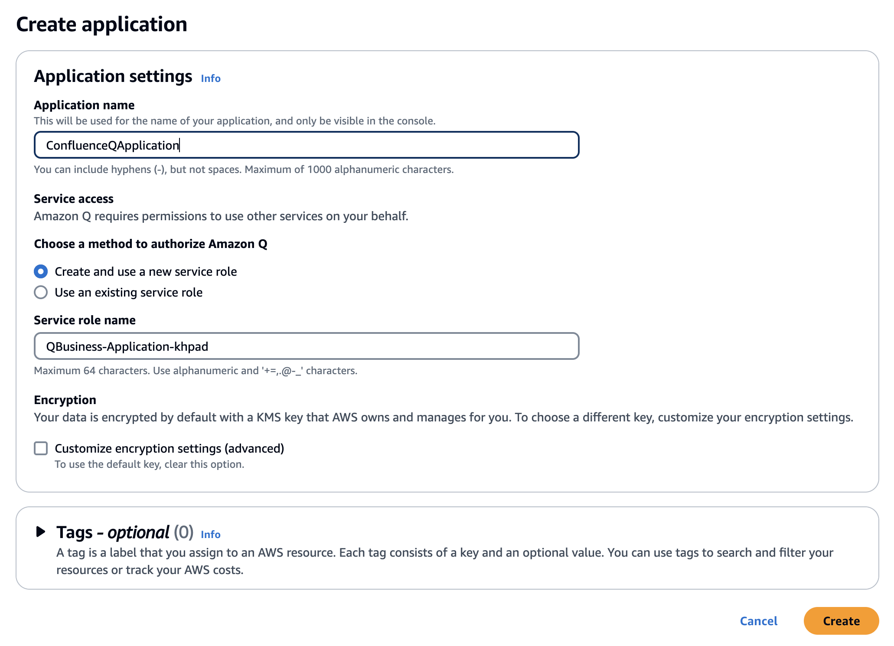
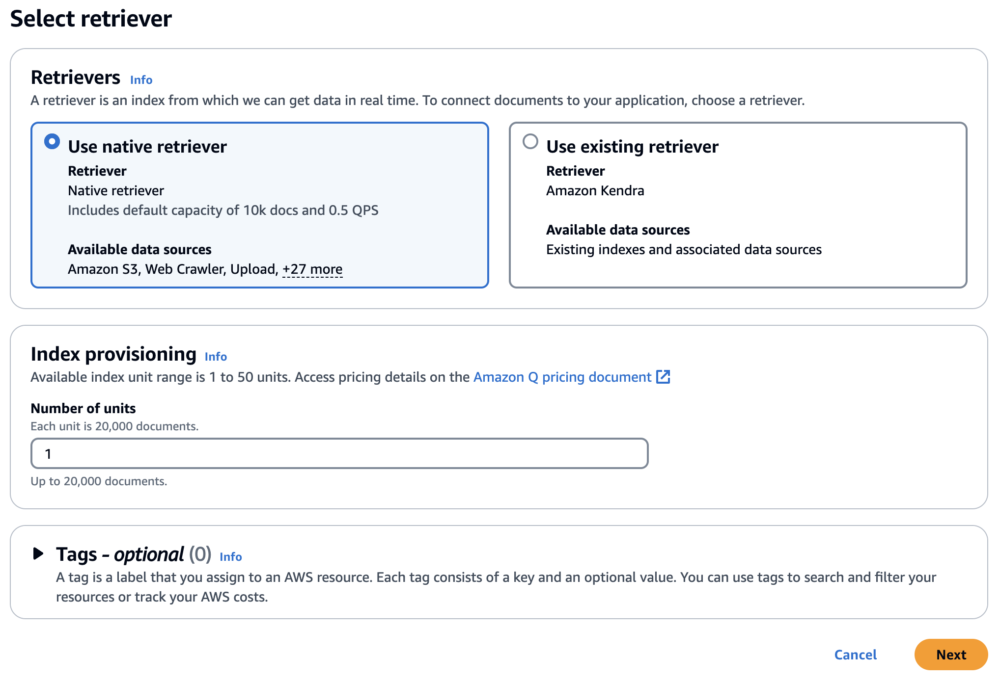
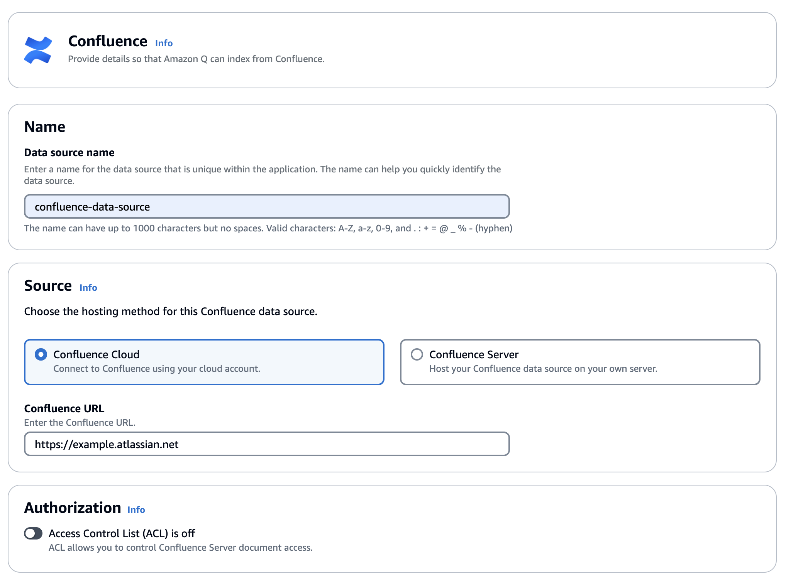
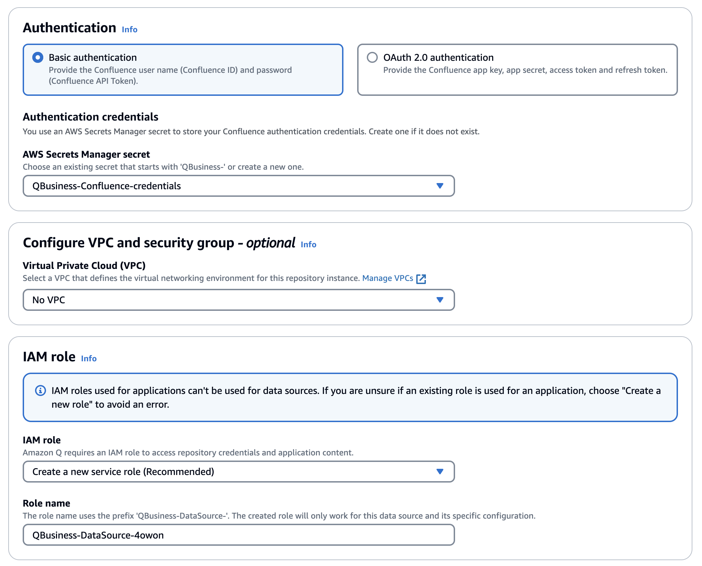
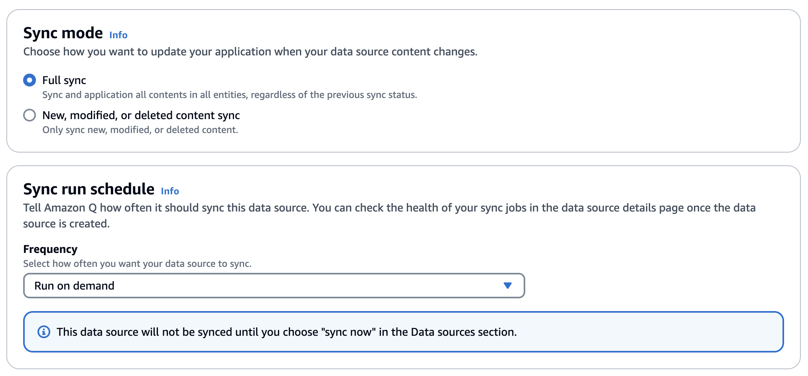
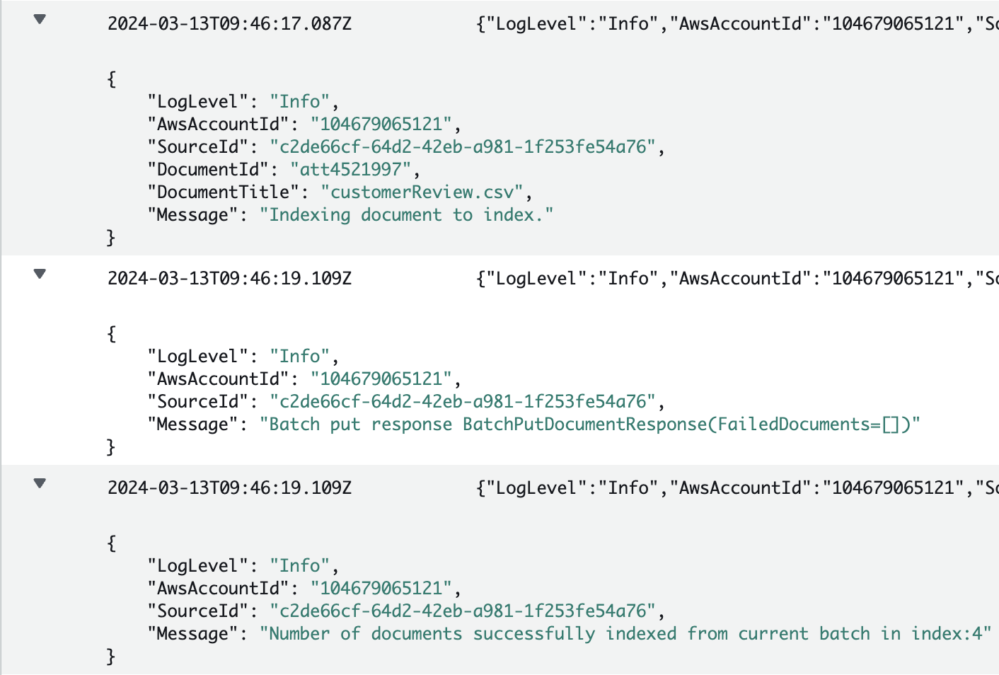
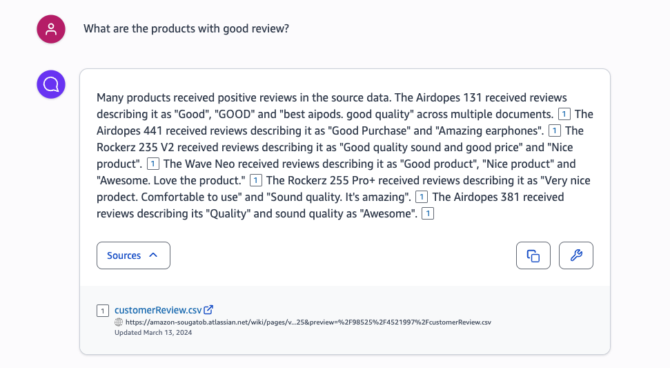
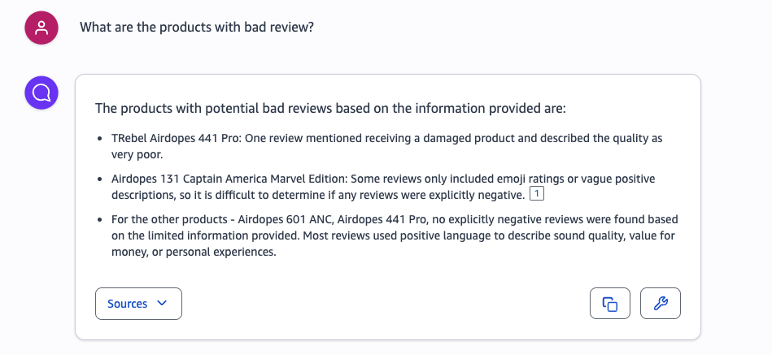
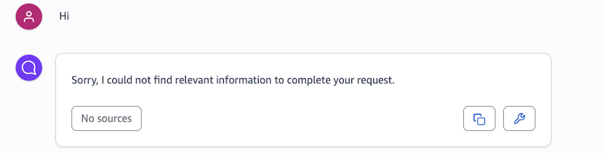

# Amazon Q Confluence (Cloud) Connector

This guide walks you through the steps to connect your Atlassian Confluence (Cloud) instance with Amazon Q, a cloud service that enables you to securely search and query data across multiple sources using natural language.

## Prerequisites
Before you begin, ensure you have the following:

### Atlassian Confluence Account
- An active Atlassian account with access to Confluence (Cloud).
- The Confluence Instance URL (e.g., `https://www.example.atlassian.net`).
- A Confluence API token for authentication. (Learn how to [create a Confluence API token](link-to-create-confluence-api-token))

### AWS Account 
- An AWS account with permissions to create and manage resources like Amazon Q, AWS Secrets Manager, and IAM roles.

  
## Step 1: Store Confluence Credentials in AWS Secrets Manager
1. Open the AWS Secrets Manager console.
2. Create a new secret with the following details:
- **Secret name**: A descriptive name for your secret.
- **Credentials**: Enter your Confluence username (email address) and the API token as the password.
3. Save the secret.

## Step 2: Create an Amazon Q Application
1. Open the Amazon Q console at https://console.aws.amazon.com/amazonq/.
2. Choose "Get started" to create a new Amazon Q application.
3. Provide an application name (e.g., "ConfluenceQApplication").
4. Select "**Create and use a new service role**" for service access.
5. Leave the encryption option as default.
6. Optionally, add tags for better organization.
7. Choose "**Create**" to finish setting up the application.

## Step 3: Create an Amazon Q Retriever
1. In the Amazon Q console, select the application you just created.
2. Choose "**Use native retriever**" for the retriever type.
3. Set the index provisioning units as per your requirements (1 unit is sufficient for testing).
4. Optionally, add tags.
5. Choose "**Next**" to set up the retriever.

## Step 4: Add Confluence as a Data Source
1. In the Amazon Q console, navigate to the "**Data sources**" section.
2. Choose "**Add data source**" and select "**Confluence Cloud**" as the hosting method.
3. Provide a data source name (e.g., "ConfluenceDataSource").
4. Enter your Confluence Instance URL (e.g., `https://www.example.atlassian.net`).
5. ==Leave Access Control Lists (ACLs) **off** for testing purposes.==

6. For authentication, choose "**Basic authentication**" and select the AWS Secrets Manager secret you created earlier.
7. Select "**Create and use a new service role**" to access repository credentials and application content.

8. Configure the sync scope to include pages, comments, attachments, personal spaces, and archived content.
9. Set the sync mode to "**Full Sync**" and the sync run schedule to "**Run on demand**"

10. Leave the field mappings as default.
11. Choose "**Add data source**" to connect Confluence to Amazon Q.
12. In the data source details, select "**Sync now**" to initiate the initial data crawl and indexing.
****Note:**** You can monitor the sync job progress by checking the CloudWatch logs.

## Step 5: Test the Connection
Once the initial sync is complete, you can start testing the Confluence integration by asking natural language questions in the Amazon Q web experience preview.

****Note:**** Amazon Q may not respond to conversational texts but will answer questions related to the indexed Confluence content.

  
## Potential Improvements
- Ability to regenerate responses in case the initial answer is unsatisfactory or if the data source is updated.
- Support for Access Control Lists (ACLs) and identity management for secure access to Confluence content.
  

Feel free to explore the Amazon Q documentation for more advanced configurations and use cases.